# 机器学习

本文地址：https://bluuur.github.io/ZidongZh/

张敦彪 贾天月 李梓月 任禹齐 孙启政 肖旖旎 颜旭 张子栋

## 感知器模型

人工智能的源头和人类智能一样，都是二元分类。输入特征，识别特征，输出结果，判断对错，不断迭代，这就是机器分类数据的流程。

$$
\huge W_1X_1+W_2X_2-b=0
$$
$W_i$ 改变斜率，$b$ 改变截距

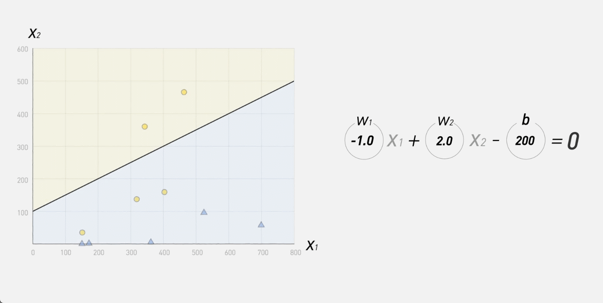

感知器模型来源以及生物神经元的数学抽象

大脑中大概有 850 亿个神经元

每个神经元可以被理解为一个开关, 接受一个或多个上游神经元的信号, 如果上游神经元发送的信号总和达到某个阈值 $W$, 那么这个神经元就会被激活, 并向下游神经元发送刺激信号或抑制信号

比如这个神经元有两个输入信号 $X_1,\ X_2$, 来自不同轴突的信号的重要程度也不同, 记为 $W_1,\ W_2$, 如果这两个信号强度的总和达到了阈值 $b$, 那么这个神经元就会被激活, 向下一个神经元发送信号 

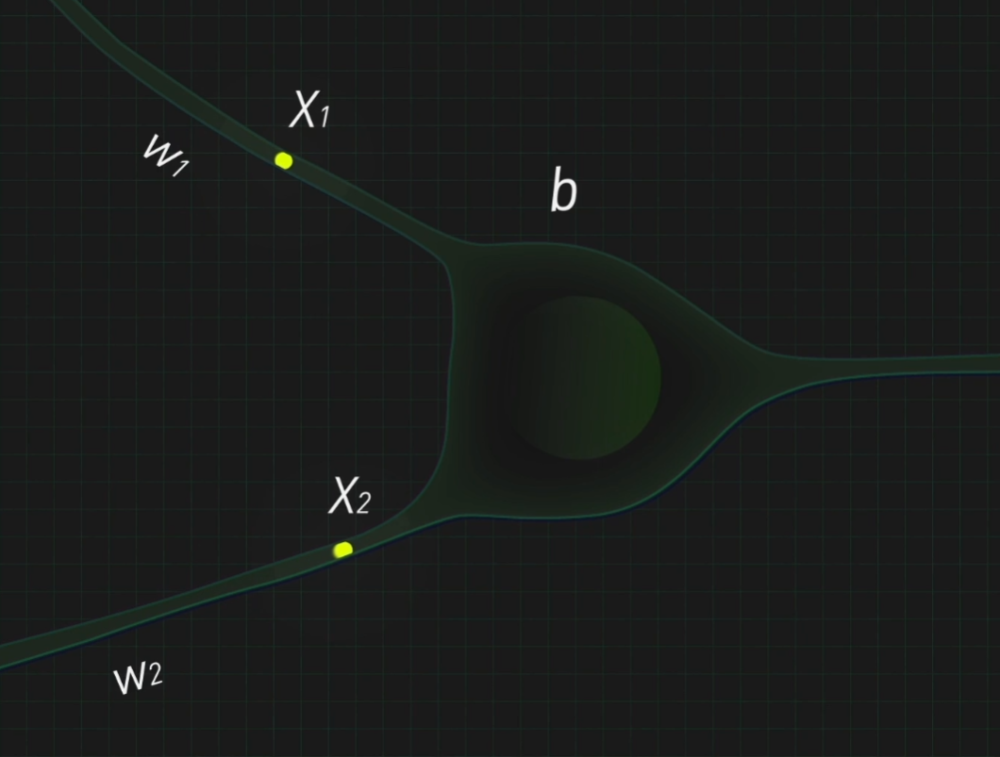

感知器公式
$$
\huge\sum_{i=1}^{n} W_i\cdot X_i + b = 0
$$
一个感知器模型包含四个方面:

+ 输入
+ 权重
+ 判断
+ 输出

神经网络就是通过这样一个个感知器模型搭建起来的

## 如何让机器学习

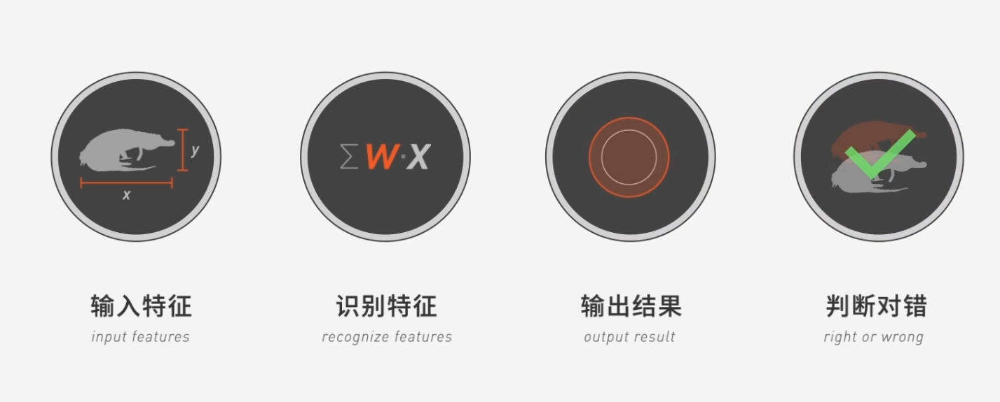

在学习过程中, 我们需要人为设定一个正确答案, 让机器知道自己错了, 并调整权重和阈值.

机器学习的核心就是让机器自动的调整参数 $W$ 和 $b$ 

如果机器判断结果错误, 比如大于阈值应该输出 $1$, 但机器输出 $0$, 说明机器的计算结果太大, 需要调整权重, 让计算结果小于阈值.

在调整权重的过程中, 会产生一个参数 $\huge\Delta W_i$ 也就是机器需要算出到底调整多少

$$
\huge\Delta W_i=(Y-y)\times X_i
$$
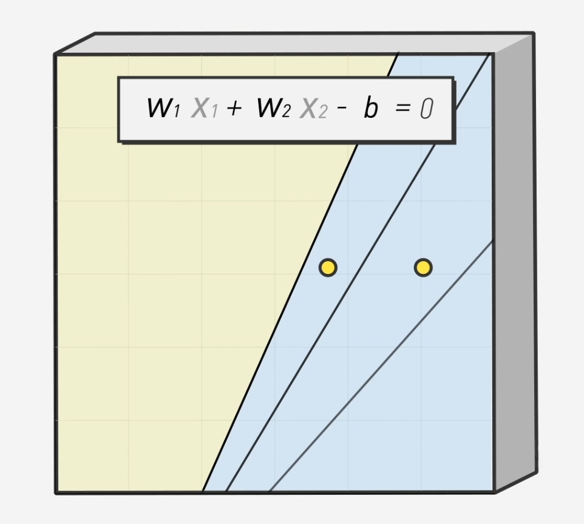

同样 $b$ 也会调整
$$
\huge\Delta b=Y-y
$$
通常还会再调整值后面再乘一个 $r$
$$
\huge\begin{aligned}
\Delta W_i&=\left [ (Y-y)\times X_i \right ]\times r\\
\Delta b&=(Y-y)\times r
\end{aligned}
$$
早在 1957 年 Frank Rosenblatt 就发明了这种感知器, 但是这种感知器有一个致命的缺点

## 线性变换与激活函数(非线性变换)

 

很多数据无法通过一条直线或一个平面/超平面进行划分

例如图中这四个点

无论这条直线怎么放, 都无法划分这四个点, 除非把这条直线弯一下

但是在感知器模型中并不能画出曲线
$$
\huge W_1X_1+W_2X_2-b=0
$$
以划分二维数据距离, 多维中就是平面或超平面

解决方法就是弯曲整个坐标系

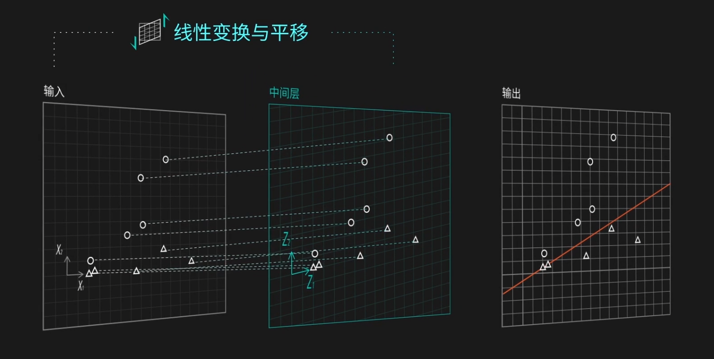

[线性代数的本质哔哩哔哩_bilibili](https://www.bilibili.com/video/BV1Ys411k7yQ/)

[【官方双语/合集】微积分的本质 - 系列合集哔哩哔哩bilibili](https://www.bilibili.com/video/BV1qW411N7FU/)

线性变换还是太直了, 变换前后直线依旧是直线, 原点不会移动

所以可以继续加一层激活函数

在前面的区分鳄鱼与蛇的过程中, 我们使用的是阶跃函数

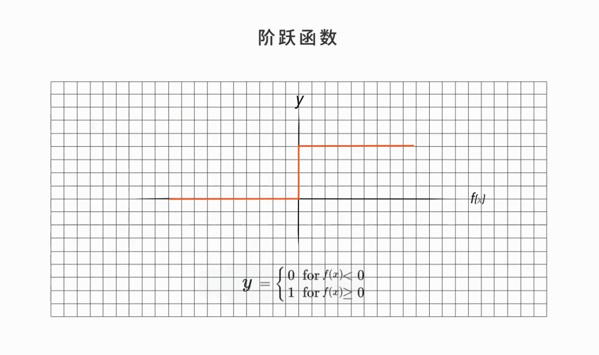

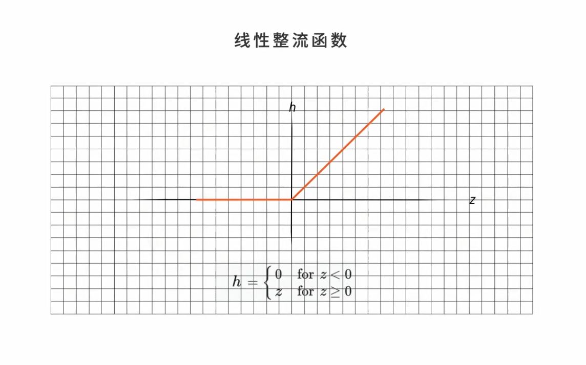

## 损失函数与梯度下降

在需要线性变换平移以及非线性变换完成划分的数据集中, 机器调整参数的过程会更复杂, 在训练过程中, 可以将误差用一个函数表示出来

$$
\huge\text{Cost} = \frac{1}{2N}\sum|Y-y|^2=f(W_i,b_i)
$$
损失函数的值越小，模型的精确度就越高。

可以通过梯度下降方法找到损失函数的最小值

+ 方向 斜率反向
+ 距离
  + 斜率 $\times$ 步长 $r$
  + $r$ 也就是学习率 

走的距离太远会错过最低点, 所以需要选择合适的步长(学习率)

多维的数据可以通过求偏导确定下降方向

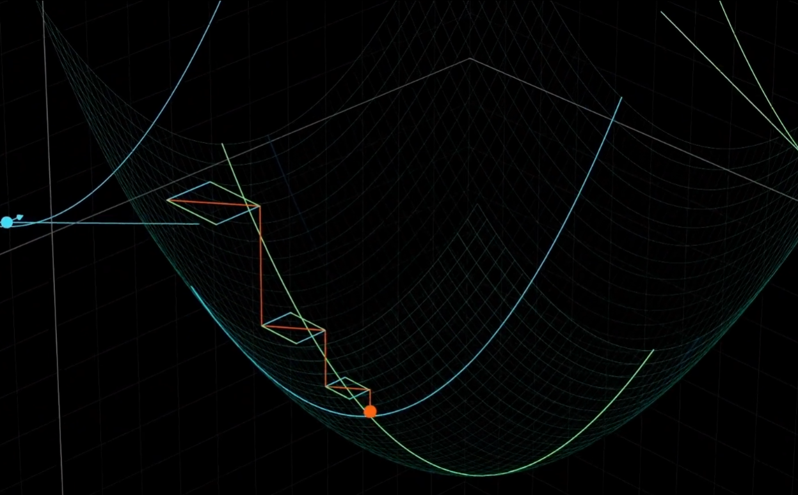

然后我们就可以让机器开始学习了

# 补充内容

## 识别图像与处理语言

### 卷积

每一张彩色图片都可以理解成三个颜色通路（红、绿、蓝），每个通道每个像素都是0-255之间的一个整数。

机器识别图像的方法是利用一个卷积核（感受野/过滤器）与输入图像的三个矩阵相互运算，得到特征图谱。

可以理解为过滤掉对我们无用的噪声数据。

但是处理图像过程中，每种问题都可能有自己独特的特征值，能否用卷积核自动找出某个任务中最合适的特征？

卷积神经网络：给卷积核赋予参数，参数会在数据上得到训练，能够越来越好的处理图像。

### 处理语言

NLU（自然语言理解）  NLP（自然语言处理）

可以类比理解为“语言学范畴+计算模型”

语言学范畴是由语言学家定义的语言学概念和标准。

在计算模型方面有两条研究路线：理性主义（规则方法）、经验主义（统计方法），早期使用规则方法，然而，因为人类语言不是形式语言，规则的制定并不容易，另一方面，自然语言的复杂性导致使得规则很难没有冲突。

直到大规模语料库的建设和统计学习方法流行后，NLP研究才逐渐面向实用。

统计方法省去很多人工编制规则的负担，在模型生成方面自动评估特征的权重，具有较好的鲁棒性。

NLP处理数据的方式是将理解自然语言的过程看作一种对语言现象的数学建模。

词语向量化，将语言变成机器适合处理的数学概念，然后进行深度学习，形成机器自己的独特语义系统。

 

总之，现在的机器学习还没有达到能理解自然语言的程度，困难多多。

难题：需要自动补齐语言中缺失的、暗示的成分，理解文字中不确定，认知带来的矛盾（一个词在不同语言下有不同，甚至截然相反的意思）等等。

## 加一层 (隐藏层)

**1.**  **异或（Xor****）问题**

主要是指在二进制运算中，

0⊕0=0,0⊕1=1

　　1⊕0=1,1⊕1=0

即两个值相同得0，不同得1。

可以把异或问题在二维平面上表示为点，即

而最简单的感知器，直观表示为：在平面上画一条直线，通过线的两边进行分类。异或问题无法通过一条直线进行分类。

所谓感知机(单层神经网络)不能解决异或问题就是不能解决画一条线在平面实现所有分类的问题。

（[感知机不能解决异或(XOR)问题 - 简书 (jianshu.com)](https://www.jianshu.com/p/853ebc9e69f6)）

于是我们要寻找解决此类问题的方法，就来到隐藏层。

**2.****隐藏层**

【1】何为隐藏层

阶层型的神经网络主要结构如下图所示，通过输入层激活信号，再通过隐藏层提取特征，不同隐藏层神经单元对应不同输入层的神经单元权重和自身偏置均可能不同，输入层兴奋传递到隐藏层兴奋，最后输出层根据不同的隐藏层权重和自身偏置输出结果。

隐藏层背负了特征提取的伟大使命，隐藏层每一个节点会对输入层的兴奋有不同的接收权重，从而更加偏向于某种识别模式。

（[深度学习的数学-神经网络、输入层、隐藏层、输出层_藏锋入鞘的博客-CSDN博客_输入层隐藏层输出层](https://blog.csdn.net/qq_34177812/article/details/104734520)）

【2】隐藏层可以帮助异或问题的解决

为了解决异或问题，需要让神经网络复杂起来，因为复杂的神经网络表征能力会得到增强。可以在输入层和输出层之间，添加一层神经元，即为隐藏层（hidden layer）。

隐藏层和输出层中的神经元都具有激活函数，假设各个神经元的阙值均为0.5，权值如图，就实现的异或的功能。

（[【深度学习之美13】多层网络是如何解决“异或”问题的？ - 知乎 (zhihu.com)](https://zhuanlan.zhihu.com/p/42041080)）

那么，何为激活函数？

**3.****激活函数与非线性变换**

激活函数（Activation Function）是一种添加到人工[神经网络](https://so.csdn.net/so/search?q=神经网络&spm=1001.2101.3001.7020)中的函数，旨在帮助网络学习数据中的复杂模式。类似于人类大脑中基于神经元的模型，激活函数最终决定了要发射给下一个神经元的内容。

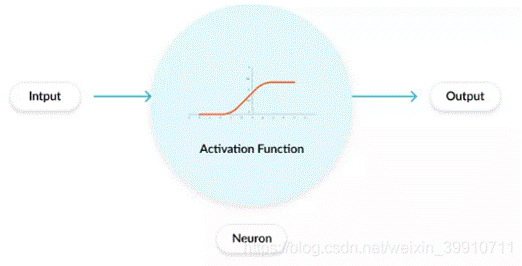

 在人工神经网络中，一个节点的激活函数定义了该节点在给定的输入或输入集合下的输出。标准的计算机芯片电路可以看作是根据输入得到开（1）或关（0）输出的数字电路激活函数。因此，激活函数是确定神经网络输出的数学方程式。

关于神经网络中的激活函数的作用，通常都是这样解释：不使用激活函数的话，神经网络的每层都只是做**线性变换**，多层输入叠加后也还是线性变换。激活函数可以引入非线性因素。

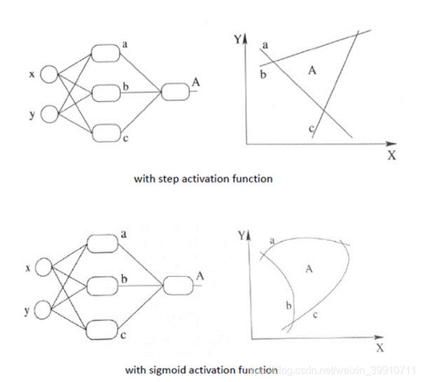

加入非线性激励函数后，神经网络就有可能学习到平滑的曲线来分割平面，而不是用复杂的线性组合逼近平滑曲线来分割平面，使神经网络的表示能力更强了，能够更好的拟合目标函数。

（[激活函数（Activation Function）_意念回复的博客-CSDN博客_activation function](https://blog.csdn.net/weixin_39910711/article/details/114849349)）

## 梯度下降

微积分原理部分请参考[【官方双语/合集】微积分的本质 - 系列合集_哔哩哔哩_bilibili](https://www.bilibili.com/video/BV1qW411N7FU/)

**代价函数**

以单变量线性回归模型为例

代价函数也被称作平方误差函数，有时也被称为平方误差代价函数。我们之所以要求出误差的平方和，是因为误差平方代价函数，对于大多数问题，特别是回归问题，都是一个合理的选择。还有其他的代价函数也能很好地发挥作用，但是平方误差代价函数可能是解决回归问题最常用的手段，代价函数为

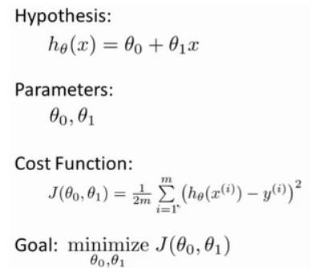

我们的目标便是选择出可以使得建模误差的平方和能够最小的模型参数。即使得代价函数

最小

我们绘制一个等高线图，可找到使得最小的点。

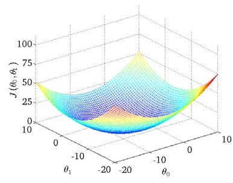

**梯度下降**

梯度下降是一个用来求函数最小值的算法，我们将使用梯度下降算法来求出代价函数的最小值

梯度下降背后的思想是：开始时我们随机选择一个参数的组合计算代价函数，然后我们寻找下一个能让代价函数值下降最多的参数组合。我们持续这么做直到找到一个局部最小值（local minimum），因为我们并没有尝试完所有的参数组合，所以不能确定我们得到的局部最小值是否便是全局最小值（global minimum），选择不同的初始参数组合，可能会找到不同的局部最小值。

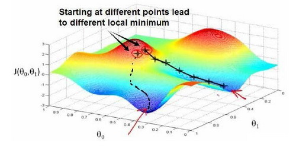

批量梯度下降（batch gradient descent）算法的公式为：

其中α为学习率（learning rate），它决定了我们沿着能让代价函数下降程度最大的方向向下迈出的步子有多大，在批量梯度下降中，我们每一次都同时让所有的参数减去学习速率乘以代价函数的导数。

如果α太小，即学习速率太小，结果就是只能一点点地挪动，去努力接近最低点，这样就需要很多步才能到达最低点；如果α太大，那么梯度下降法可能会越过最低点，甚至可能无法收敛。

即对代价函数求导得

参考：[Coursera-ML-AndrewNg-Notes/week1.md at master · fengdu78/Coursera-ML-AndrewNg-Notes · GitHub](https://github.com/fengdu78/Coursera-ML-AndrewNg-Notes/blob/master/markdown/week1.md)

## 机器学习 - 线性变换

请参考[【官方双语/合集】线性代数的本质 - 系列合集_哔哩哔哩_bilibili](https://www.bilibili.com/video/BV1ys411472E/)

变换是向量的的运动，变换让向量从一个地方（对应输入向量），运动到了另一个地方（对应输出向量）。

我们说将变换作用于某个空间，意思是将该变换应用于空间中的每一个向量。

空间中的向量可以用一些规则分布的点来表示

线性变换的性质：

变换前后，所有的直线仍然是直线

变换前后，原点保持不变

 

**线性变换的描述**

以平面直接坐标系为例，假定我们有一个向量 v=[−1 2]。我们可以将它看成是 2 个基向量 i, j 的线性组合。线性组合的系数分别对应向量的 2 个分量。

**基向量**

在线性代数中，基(basis)（也称为基底）是描述、刻画向量空间的基本工具。向量空间的基是它的一个特殊的子集，基的元素称为基向量。向量空间中任意一个元素，都可以唯一地表示成基向量的线性组合。

我们只要知道线性变换之后，i, j 的位置（坐标），就可以计算出任意一个向量经过同样的线性变换之后的位置（坐标）。

 

**常见的矩阵与变换**

正交矩阵：将一组正交基旋转到另一组正交基，所以，对向量做旋转变换

实对称矩阵：对特征向量做且只做拉伸剪切变换

矩阵相乘的意义是对向量做变换，即向量的运动。

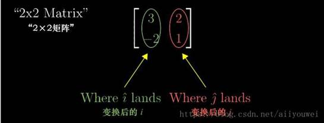

 

将变换后基向量的坐标按列拼接成一个矩阵。这个矩阵为我们提供了一种描述线性变换的语言。线性变换作用于一个向量，对应于用线性变换矩阵左乘该向量。

[基本操作(jibencaozuo.com)](https://jibencaozuo.com/zh-Hans/)

